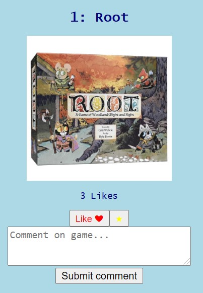
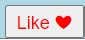
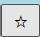
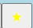
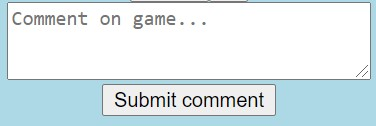

# Top 25 Board Games

*This application displays a list of the 25 most popular games as ranked by the Board Game Atlas website,[BoardGameAtlas.com](BoardGameAtlas.com), and lets the user like, favorite, and comment on each game. The follwing api below is used to pull this list:*

[https://api.boardgameatlas.com/api/search?order_by/rank&client_id=at1HSHmb21](https://api.boardgameatlas.com/api/search?order_by/rank&client_id=at1HSHmb21)

## Functionality

These games are displayed on the webpage with the name, rank, and image of the game. Below each game there is a like button, a favorite button, and a comment form. Below is an example of how each game will appear on the page along with its corresponding buttons and comment form.

- 

Clicking the like button will update the like button counter for each game. Text below the game image displays the number of likes each game has.

-  /  

Clicking the favorite button toggles the buttons status from unfavorited to favorited. The default setting is unfavorited which is displayed as a black star shape outline. The favorited status is displayed as a filled in yellow star.

- 

Typing a comment and submitting it using the "Submit comment" button will post your comment to the Comment section at the bottom of the page. The comment will appear with the name of the game commented followed by the users input, seperated by a colon.
